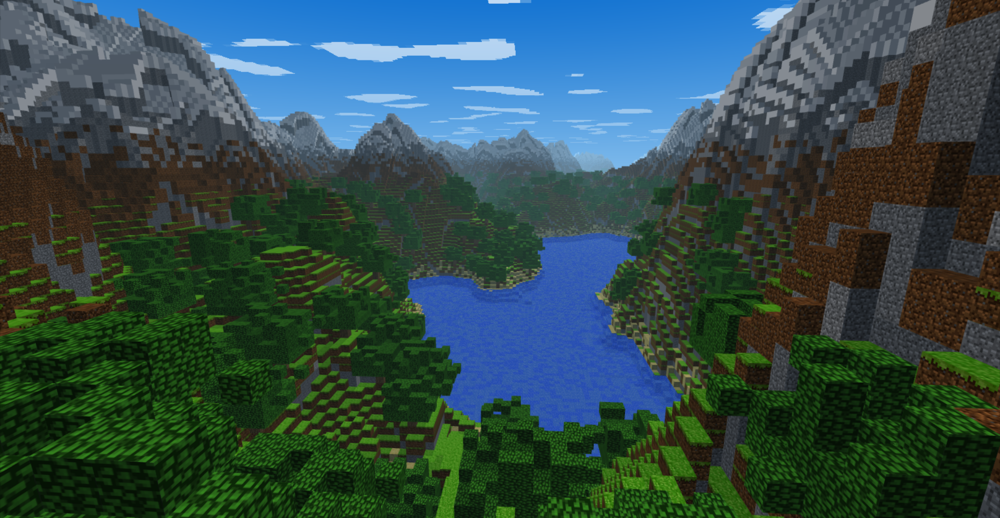
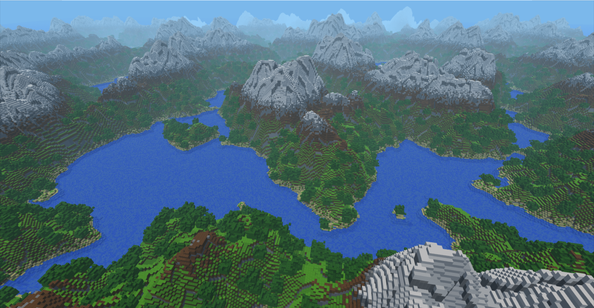
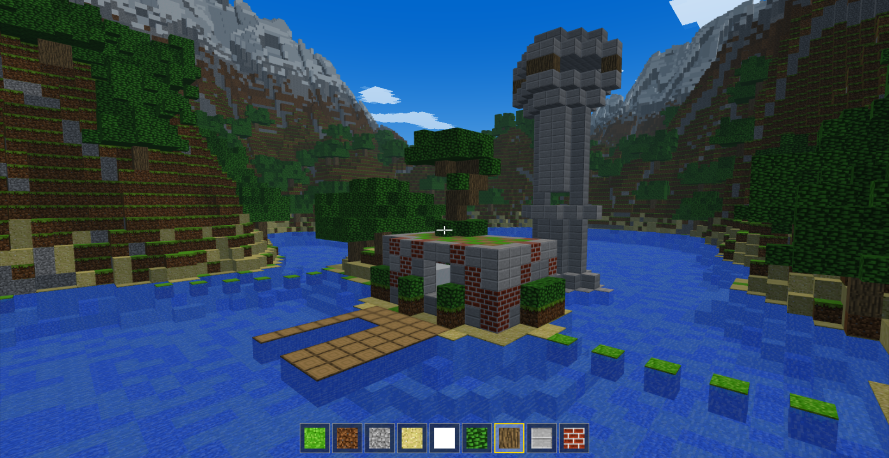
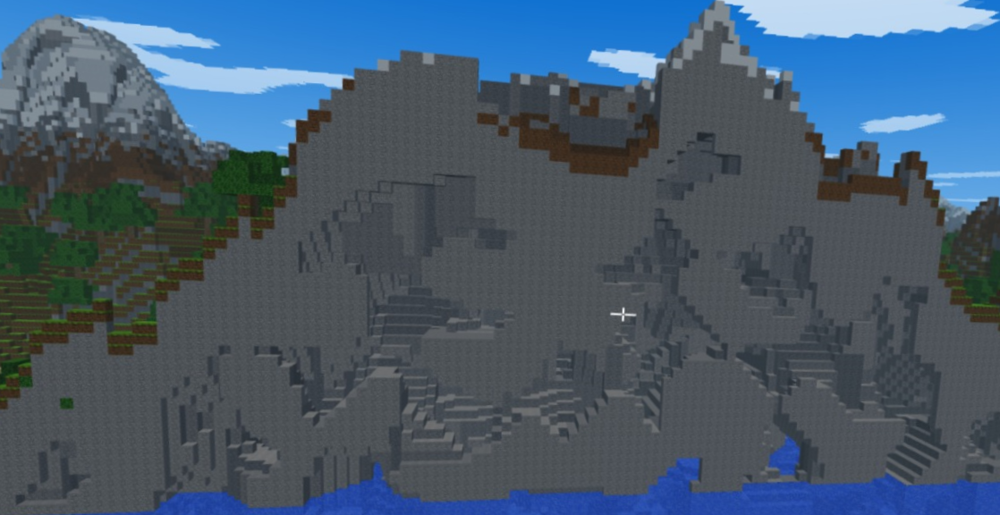

# Minecraft Clone

<!-- Media Placeholders -->
<div align="center">
  
  
  
  
</div>

A comprehensive voxel-based engine built with Python, delivering a Minecraft-like experience. The project focuses on high performance and smooth gameplay by leveraging modern OpenGL features, multi-threading, and meshing algorithms.

## Features

- **Infinite world:** Terrain is procedurally generated and loads dynamically as you explore — there are no borders or pre-built maps.
- **Biomes:** 26 of them, chosen the way the real game does it — continentalness, erosion and weirdness shape the land, temperature and humidity decide what grows on it, at the real game's own noise wavelengths. Oceans and beaches, plains and meadows, four kinds of forest, taiga, jungle, savanna, desert, swamp, badlands with terracotta strata, windswept hills and snowy peaks, each with its own surface blocks and its own trees. Borders are a domain warp on the climate rather than a line, so one biome fingers into the next; the sea, the shore and the snow line are drawn on the smooth fields underneath rather than on the terrain's own texture, so none of them come out speckled.
- **Continents, oceans, and mountains that are ranges:** Land and sea are decided at a 2000-block scale, so a coastline is a coastline and an ocean takes a while to cross. Relief comes from a ridged multifractal whose octaves feed each other, so crests run for hundreds of blocks and grow branching spurs and foothills instead of standing up as isolated cones, and peaks reach 140 blocks above the water. Erosion decides a whole region's character *and* how high its floor sits — the same expression is a rolling plain in one place and an alpine ridge system in another.
- **Rivers, seas and caves:** Rivers wind along the zero crossing of the terrain noise and cut a valley four times their own width, so a river has banks rather than walls; they sit in the valley floors the same noise carves and run down to a real sea you can swim in — not a flat plane over a dry basin. Underground, two crossing noise fields carve tunnels through granite, diorite, andesite and tuff, and ore veins are layered by depth from coal near the surface down to diamond at the bedrock.
- **Forests you can tell apart:** Fourteen tree shapes drawn from a per-biome mix, following the real game's own selector weights — oaks and branching big oaks on the plains, spruce and pine in the taiga, 2×2 giants, forked acacias, dark oak roofs with huge mushrooms under them, jungle bushes, cherry, and fallen trunks on the forest floor. Every trunk height and crown radius is the real game's, so a birch reads as a birch. Snow settles on the canopies where it settles on the ground. Boulders, gravel and clay disks, coarse dirt and podzol patches break up the ground between them.
- **Villages:** Roughly one every 700 blocks on habitable ground — a street grid with houses, two-storey houses, farms with irrigation channels, animal pens, watchtowers and libraries in its squares, plus a well, lamp posts and gabled roofs. Buildings stand at the height of their own plot and streets follow the ground, so a village settles onto rolling terrain instead of levelling it. Materials follow the biome: oak and brick on the plains, sandstone in the desert, acacia and thatch on the savanna, spruce and cobblestone in the snow.
- **Block interaction:** Raycasted placement and removal with an 8-block reach, across **358 block types** — stone, deepslate and ore variants, ten wood sets in log, bark and stripped form, building blocks, decoration, the nether and copper families, corals, the full wool, concrete, concrete powder and terracotta palettes, and glass.
- **See-through blocks:** glass, all sixteen stained glass colours, tinted glass, ice and the copper grates, drawn by a second blended pass that leaves the opaque terrain pass untouched — a world without them costs nothing.
- **Creative block picker:** `E` opens a tabbed window — one page per category plus an "everything" page, scrolled with the wheel. Hover for the block's name, type to search across all categories, click to drop it into the selected hotbar slot.
- **Walking & flying:** Switch between grounded movement with gravity and collision, and a free-flying mode useful for building or just exploring quickly.
- **Performance-first rendering:** Render distance is adjustable at runtime (2–96 chunks), chunk geometry is built in background threads so the game never freezes mid-exploration, and frustum culling trims down what actually gets sent to the GPU.
- **Visual detail:** Custom GLSL shaders, a procedural sky, ambient occlusion on block faces, and a transparent animated water surface. Textures are sampled with the real game's own texel-centre snap, which keeps blocks hard-edged up close without the crawling that plain nearest-neighbour filtering gives a wall of repeating blocks as you walk past it.

## Controls

| Action | Key / Input |
| :--- | :--- |
| Move | `W` `A` `S` `D` |
| Look | `Mouse` |
| Jump (Walk) / Ascend (Fly) | `Space` |
| Run (Walk) / Descend (Fly) | `Shift` |
| Toggle Fly Mode | `TAB` |
| Toggle Mouse Capture | `ESC` |
| Remove Block | `Left Click` |
| Place Block | `Right Click` |
| Select Hotbar Slot | `1` - `9` / `Mouse Wheel` (click a slot while the picker is open) |
| Creative Block Picker | `E` (`ESC` closes) |
| Search Blocks by Name | type while the picker is open |
| Scroll the Block List | `Mouse Wheel` / drag the scrollbar |
| Adjust Render Distance | `+` / `-` |
| Toggle Frustum Culling | `F` |

## Installation & Setup

1. **Clone the repository:**
   ```bash
   git clone https://github.com/iEmreM/Minecraft-Clone.git
   cd Minecraft-Clone
   ```

2. **Create a virtual environment (Recommended):**
   ```bash
   # Windows
   python -m venv venv
   venv\Scripts\activate

   # Linux/MacOS
   python3 -m venv venv
   source venv/bin/activate
   ```

3. **Install the dependencies:**
   ```bash
   pip install -r requirements.txt
   ```

4. **Run the game:**
   ```bash
   python main.py
   ```

## Technologies & Technical Architecture

The architecture is designed to overcome Python's performance bottlenecks when handling large arrays of volumetric data, employing a highly modular and optimized tech stack:

- **Core Engine (Python):** The foundation of the game logic and state management.
- **Graphics Pipeline (ModernGL):** A high-performance Python wrapper over modern OpenGL core contexts, replacing legacy fixed-function pipelines with programmable shaders.
- **Window & Input (Pygame):** Handing cross-platform window initialization, event polling, and mouse capturing.
- **Mathematical Operations (NumPy & PyGLM):** Used for intensive matrix transformations and efficient manipulation of large vertex buffers.
- **JIT Compilation (Numba):** Just-In-Time compilation accelerates heavy CPU-bound tasks such as terrain generation and voxel meshing, achieving near-C speeds.

### Key Subsystems
- **ThreadedChunkManager:** Chunk generation and mesh building run on worker threads, so the main loop stays smooth even when loading new areas of the world.
- **FastBuilder:** Uses greedy meshing — adjacent faces of the same block type are merged into a single quad rather than drawn individually, which significantly cuts vertex count and GPU load.
- **Frustum Culling:** Chunks entirely outside the camera's view are discarded before they ever reach the GPU. Can be toggled at runtime for comparison.

## Project Structure

```text
Minecraft-Clone/
├── engine/                 # Core engine components (rendering, camera systems, culling)
├── shaders/                # Custom GLSL vertex and fragment shaders 
├── world/                  # Voxel generation, chunk management, multi-threading
│   └── blocks.py           # Block registry — id, name, per-face texture, hotbar
├── main.py                 # Application entry point and game loop
├── build_atlas.py          # Bakes texture.png from the block registry (dev tool)
├── requirements.txt        # Python dependency manifest
├── texture.png             # Block texture array: 16x16 tiles in one column
└── README.md               # Project documentation
```

## Contributing

Pull requests are welcome. If you have a bug fix, a performance improvement, or a new feature in mind, feel free to open one. For larger changes, opening an issue first to discuss the approach tends to save time.

## License

Distributed under the terms specified in the `LICENSE` file.
